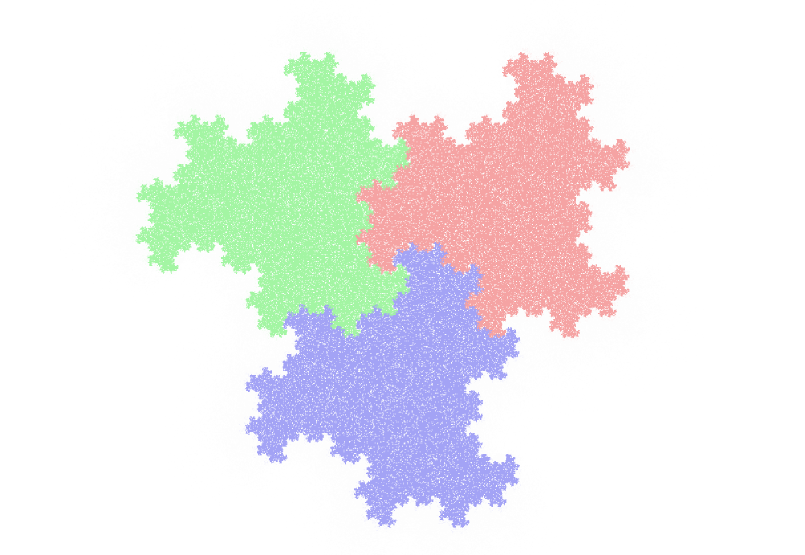

# Chaos game

Interactive demonstration of the [Chaos game](https://en.wikipedia.org/wiki/Chaos_game), written in pure JavaScript. This program renders images to a canvas element, while commands are implemented via HTML form elements and SVG.

In this demonstration, all vertices and parameters are treated as complex numbers.

The orbit of the point $P_0$ is generated iteratively by the formula
$$P_{i+1} = \lambda (P_i + V)$$
where $V$ is a randomly chosen vertex of the polygon, and $\lambda$ is fixed parameter (in  the "original" Chaos game, $\lambda = \frac{1}{2}$).

## Hacking and Contributing 

Even if the code contains a few hundred lines, the main drawing logic is concentrated in a few lines of the `draw` function.
All other functions are used for UI.

Some ideas for future development
 + Better control of 'clearing' between redraws
 + More control of the number of iterations per frame. Automatic selection based on the time required to render a frame
 + Advanced rules: disallowing consequent selection of same vertex, forbidden domains, etc...
 + Switching to WebGL renderer/WASM core if that brings more performance

Contributions and new ideas are more than welcome.
